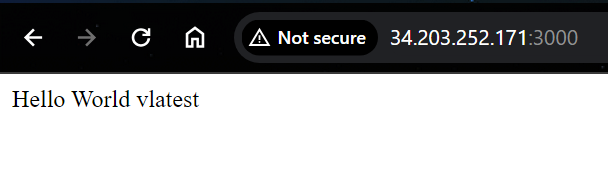
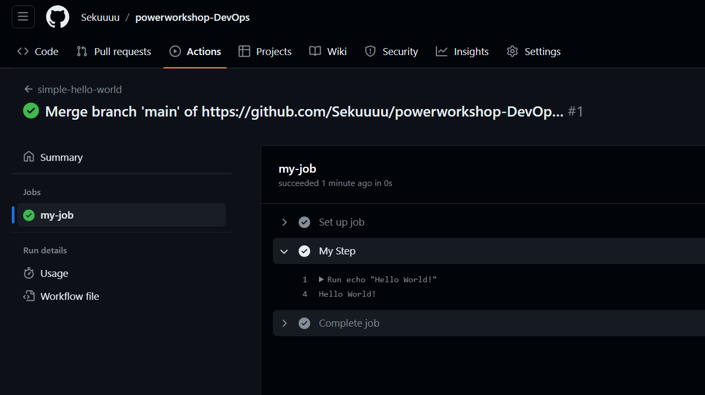

# php-hello-world
A simple hello-world for composer

Installation
------------

Install with composer
``` bash
composer install
```

Build docker image
``` bash
docker build -t phpdocker .
docker run -dp 0.0.0.0:3000:80 phpdocker
```

OR use docker-compose
```
docker-compose build
docker-compose up -d
```


Output



